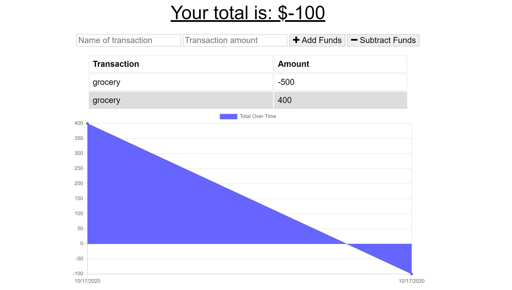

# PWA-Online-Offline-Budget-Trackers

This is a Budget Tracker application to allow for offline access and functionality.

The user is able to add expenses and deposits to their budget with or without a connection. When entering transactions offline, they should populate the total when brought back online.

Offline Functionality:

  * Enter deposits offline

  * Enter expenses offline

When brought back online:

  * Offline entries should be added to tracker.

## User Story
AS AN avid traveller
I WANT to be able to track my withdrawals and deposits with or without a data/internet connection
SO THAT my account balance is accurate when I am traveling

## Business Context
Giving users a fast and easy way to track their money is important, but allowing them to access that information anytime is even more important. Having offline functionality is paramount to our applications success.

## What is PWA?
A progressive web application is a type of application software delivered through the web, built using common web technologies including HTML, CSS and JavaScript. It is intended to work on any platform that uses a standards-compliant browser, including both desktop and mobile devices. Source: [Wikipedia!](https://en.wikipedia.org/wiki/Progressive_web_application)

## Preview Image and Deployed App

* Deployed app: [here!](https://quiet-falls-63309.herokuapp.com/)

## Copyrights
Hae Seung Sung 2020
